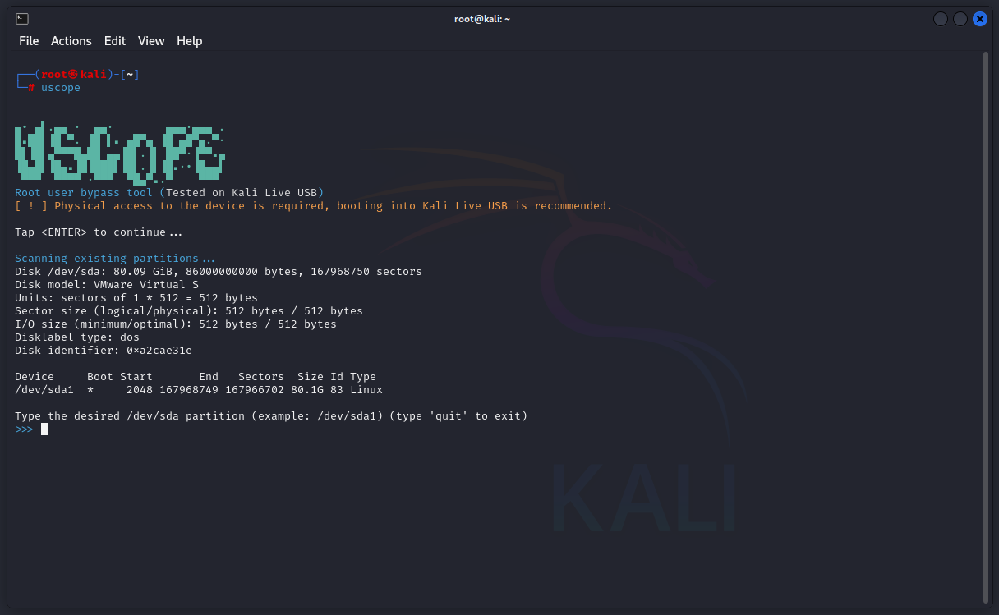

# Uscope
UScope Tool is a utility for gaining access to a target system with physical access to it. It starts a chroot environment inside the file system and adds a sudoers user to further control the system.
